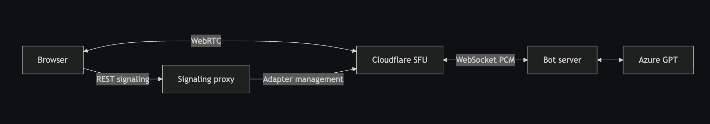

Most "voice AI" tutorials hand you a managed platform, a magic SDK, and a bill that scales with per-participant minutes. This post is about the other path: wiring a [Pipecat](https://github.com/pipecat-ai/pipecat) bot to the raw [Cloudflare Realtime SFU](https://developers.cloudflare.com/realtime/) over its new WebSocket media adapter, paying only for bandwidth, and owning the whole media path.

I'll walk through the architecture I built, what I learned along the way, the uncomfortable fact that the adapter is beta, the production architecture I'd actually ship, and then a grounded comparison against [LiveKit](https://livekit.com/) — the obvious alternative — on the two axes that decide these projects: **latency** and **cost**. Because LiveKit is open source, I treat it as *two* options throughout: **LiveKit Cloud** (managed) and **self-hosted LiveKit** (you run the SFU).

## TL;DR

**What it is:** A browser-to-bot voice AI pipeline using Cloudflare's Realtime SFU as the media layer, with a Python [Pipecat](https://github.com/pipecat-ai/pipecat) bot bridged via a WebSocket PCM adapter instead of a voice-AI platform SDK.

**The catch:** The WebSocket adapter is **beta** — the API may change. The Cloudflare SFU itself is GA; only this specific bridge isn't. For production today, the safer path is having the bot join the SFU as a real WebRTC peer via aiortc (same Cloudflare, same cost story, just more code).

**Cost story:** Cloudflare bills on egress bandwidth only — **$0.05/GB with 1 TB free**, no per-minute meters. LiveKit Cloud adds per-minute meters (agent + participant minutes) that dominate the bill at \~**$0.63/hour** vs. Cloudflare's \~**$0.035/hour** for transport. Self-hosted LiveKit removes those meters but puts servers and ops on you; it wins on cheap-egress infra (Hetzner/DigitalOcean), loses on AWS/GCP where bandwidth costs more than Cloudflare's managed rate. In all cases, the **model layer dwarfs the transport** — though how much depends on your pipeline architecture (a single realtime model vs. a chained STT → LLM → TTS stack, which can be considerably cheaper).

**Latency:** All three are edge-optimized WebRTC SFUs and feel similar when deployed close to users. The real bottleneck is the model pipeline, not the transport.

**Who should use what:**
- **LiveKit Cloud** — ship fast, GA managed service, don't want to build glue
- **Self-hosted LiveKit** — want LiveKit's SDK ergonomics, have ops capacity, running on budget infra
- **Cloudflare + Pipecat** — own the media path, no per-minute meters, comfortable with beta APIs and writing transport code (this post is your map, and the whole demo fits in under 24 hours)

Read on for the full architecture, what I learned building it, and the detailed cost/latency breakdown.

---

## What I built

A browser talks to a speech-to-speech bot (Azure OpenAI GPT Realtime) in real time. The twist is the transport: instead of a voice-AI platform SDK, the media rides Cloudflare's SFU, and Cloudflare bridges it to my Python bot over a plain WebSocket carrying PCM.

Three moving parts:

- **Browser client** — captures the mic, connects to the SFU over WebRTC, and plays back the bot's audio track.
- **Signaling proxy** — a thin server that keeps the Cloudflare app secret off the browser and handles session setup.
- **Bot server** — a Pipecat pipeline connecting the transport layer to the Azure Realtime model, fronted by a custom Cloudflare WebSocket adapter transport.

The interesting bit is Cloudflare's [WebSocket media transport adapter](https://developers.cloudflare.com/realtime/sfu/media-transport-adapters/websocket-adapter/) (currently in beta), which lets any WebSocket endpoint act as a media source or sink for the SFU. Two unidirectional adapters wire up the bot:

- **SFU → bot** — the SFU pulls the browser's mic track and streams it to the bot as raw audio frames over a WebSocket.
- **Bot → SFU** — the bot pushes its generated audio back over a second WebSocket; the SFU turns that into a new WebRTC track that the browser plays.

The wire format between the SFU and the bot is uncompressed PCM — fixed at 48 kHz stereo — while the model speaks a different rate and channel count, so the transport bridges the two formats in both directions.

## What I learned building it

The full demo — browser client, signaling proxy, and Pipecat bot — came together in under 24 hours. Pipecat's transport-agnostic design meant the pipeline itself was the easy part; the interesting work was in the glue between the pieces. A few things worth knowing going in:

**Know your wire formats upfront.** The WebSocket adapter speaks 48 kHz stereo PCM; Azure Realtime speaks 24 kHz mono. Neither side is wrong — they just speak different dialects. Mapping those out before writing any code makes the conversion logic obvious rather than emergent.

**Pipecat's transport layer needs to be told it's ready.** The output transport won't forward frames until it's been marked ready. It's a one-liner once you know it's there — worth reading the framework source alongside the docs when writing a custom transport.

**Browser event ordering has real sequencing constraints.** A WebRTC track event fires *during* `setRemoteDescription()`, so the `ontrack` handler needs to be registered before that call. Easy fix, good to know ahead of time.

The broader takeaway: assembling raw pieces (SFU + WebSocket bridge + Pipecat + Azure Realtime) is straightforward when you understand each component's expectations. The glue is only a few hundred lines.

## One important caveat: the adapter is beta

The most important caveat in this whole post: **the WebSocket adapter this project relies on is beta.** The docs say so plainly — *"WebSocket adapter is in beta. The API may change."* That doesn't mean "Cloudflare isn't production-ready" — it means *this specific bridge* isn't. It's worth pulling the two apart:

- **GA today:** the Cloudflare Realtime **SFU and TURN** are generally available production services (billed at $0.05/GB egress). And the SFU's **core sessions/tracks HTTPS API** — `POST /sessions/new`, `/tracks/new` with SDP offer/answer over standard WebRTC (ICE/DTLS/RTP) — carries **no beta warning**. That's the same API my browser client already uses.
- **Beta:** the **WebSocket PCM adapter** — the turnkey "audio over WebSocket" bridge that lets my Python bot skip WebRTC entirely — is the one part labeled beta, with no API-stability guarantee and (currently) free but provisional pricing.

For an internal pilot, shipping on the beta adapter is fine if you pin behavior and add tests against the wire format. For an **enterprise GA** — where procurement and legal balk at "API may change," and you need an SLA — depending on a beta bridge is the wrong call.

## What production architecture I'd actually use

Here's the reassuring part: **you don't have to leave Cloudflare to get to GA.** The beta is only the convenience bridge; the SFU underneath is GA. Cloudflare's own [example architecture](https://developers.cloudflare.com/realtime/sfu/example-architecture) explicitly supports **headless clients** — bots that join the SFU as full WebRTC participants, publishing and subscribing to tracks exactly as a browser does. That's the production path.

In practice this means giving the bot a server-side WebRTC stack. For this Python/Pipecat setup, **aiortc** is what I'd reach for — it's what Pipecat's `SmallWebRTCTransport` already uses, it handles Opus decoding via PyAV, and it speaks the same SDP offer/answer flow that Cloudflare's sessions/tracks API expects. But aiortc is my implementation choice here, not a Cloudflare requirement — any server-side WebRTC library that can do a standard SDP exchange would work.

What changes and what doesn't:

- **Unchanged:** the Pipecat pipeline, the input/output transport interface, and the existing signaling proxy — all of it carries over untouched.
- **Input path:** the bot receives the browser's audio track via WebRTC, decoded from Opus to PCM by aiortc. This replaces the protobuf parsing the WebSocket adapter currently handles.
- **Output path:** the bot's generated audio goes back through a WebRTC media track; aiortc encodes it to Opus before it reaches the browser. This replaces the manual PCM formatting the adapter currently does.
- **Signaling:** a standard SDP offer/answer exchange with Cloudflare's tracks API — one to push the bot's audio track, one to pull the user's.
- **Bonus:** audio stays Opus end-to-end, eliminating the large uncompressed PCM leg the WebSocket adapter introduces — so this path is also considerably cheaper on bandwidth.

The trade-offs: there's no Cloudflare server SDK or Pipecat-native Cloudflare transport, so this is custom-transport work; and aiortc, being pure Python, has a lower per-instance concurrency ceiling than a compiled stack — worth benchmarking before scaling hard.

So the honest verdict: **the adapter-based build in this post is an excellent prototype; having the bot join as a headless WebRTC participant is the production path** — same Cloudflare SFU, same cost story, just a proper WebRTC peer instead of a WebSocket bridge. If you'd rather not build a custom WebRTC transport at all, LiveKit's media transport is available today. The rest of this post compares those options.

### The three options being compared

LiveKit is the natural point of comparison. It's also a WebRTC SFU, it has a first-class [Agents framework](https://docs.livekit.io/agents/) that plugs straight into OpenAI/Azure/Gemini realtime models, and it's what most teams reach for. But "LiveKit" is really two options, because the [server](https://github.com/livekit/livekit) and [Agents framework](https://github.com/livekit/agents) are both **Apache-2.0 open source**. So the field is three-wide:

1. **Cloudflare SFU + Pipecat** (this project) — raw SFU, bandwidth-only cost, you assemble the glue.
2. **LiveKit Cloud** — managed SFU + Agents, per-minute billing, zero infra to run.
3. **Self-hosted LiveKit** — the same LiveKit software on your own servers; no software fee, but you operate the SFU (plus Redis/TURN for a distributed deployment).

They trade off along the same axis — **managed convenience vs. raw control vs. bandwidth economics** — but land in different places:

| Dimension | **Cloudflare SFU + Pipecat** | **LiveKit Cloud** | **Self-hosted LiveKit** |
|---|---|---|---|
| Media transport | Cloudflare Realtime SFU (WebRTC), bot bridged via WebSocket PCM | LiveKit SFU (WebRTC), managed distributed mesh | LiveKit SFU (WebRTC), your servers |
| Agent framework | Pipecat (transport-agnostic; comparable pipeline primitives to LiveKit Agents — STT, LLM, TTS, turn detection, interruptions — with more explicit configuration) | LiveKit Agents (Python/Node; turn detection, interruptions, reconnection, and provider plugins built-in; managed deployments) | LiveKit Agents (Python/Node; same built-in capabilities, self-operated) |
| LLM integration | You wire it (Azure Realtime here) | Plugins (BYOK) + optional managed Inference | Plugins (BYOK) |
| Who runs the infra | You run the bot; Cloudflare runs the SFU | LiveKit runs everything | You run SFU (+ Redis/TURN/LB for distributed) + bot |
| Signaling | You build the proxy | Handled by LiveKit SDKs | Handled by LiveKit SDKs |
| Software cost | $0 (pay bandwidth) | Per-minute + egress tiers | $0 (Apache-2.0; pay servers + bandwidth) |
| Ops burden | Low–medium (one bot + proxy) | None | Medium–high (SFU; + Redis/TURN/LB & scaling for distributed) |
| Maturity | WebSocket adapter is **beta** | GA (managed) | GA software, self-operated |

All three are SFUs forwarding packets rather than mixing them. The real difference is *how much you assemble and operate yourself*. With LiveKit Cloud, the Agents SDK handles signaling, turn detection, interruptions, reconnection, and global placement in a batteries-included package. Pipecat covers the same agent-layer capabilities — STT, LLM, TTS, turn detection, interruptions — but is transport-agnostic, meaning it works across platforms including Cloudflare, Daily, and LiveKit itself. The trade is more explicit configuration in exchange for full control and no per-minute meters. Self-hosted LiveKit gives you LiveKit's SDK ergonomics but hands you the servers to run.

## Cloudflare vs LiveKit: latency

Both platforms optimize for the same thing — get media onto a global backbone close to the user — but neither publishes a clean end-to-end voice round-trip number, so be skeptical of precise claims (including mine).

**Cloudflare** runs the SFU on its edge network across hundreds of cities. TURN allocations are homed to the nearest data center via anycast, and when both legs are on Cloudflare, media rides the [Cloudflare backbone end to end](https://developers.cloudflare.com/realtime/turn/faq/) rather than the open internet. Cloudflare's Realtime docs publish **no median latency figure** — the advantage is qualitative (proximity + backbone).

**LiveKit Cloud** is a [distributed mesh of SFUs](https://livekit.com/blog/scaling-webrtc-with-distributed-mesh); participants connect to their nearest instance and sessions can span data centers. Its pricing page advertises delivering **"voice and video worldwide in under 250ms."** Treat that as a marketing transport figure, not a measured end-to-end voice round-trip — and note LiveKit's separately published latency benchmarks are *LLM inference* numbers (e.g., \~192 ms time-to-first-token for their hosted Gemma 4), which are a different measurement again. Don't conflate transport latency, inference latency, and end-to-end voice latency.

**Self-hosted LiveKit** gets you the same SFU software but *not* the managed mesh's global footprint for free — that geographic distribution is something LiveKit Cloud operates for you. Self-hosted, your latency is only as good as your own deployment: a single-region SFU means users on other continents pay the cross-ocean hop, and multi-region placement (with LiveKit's region-aware node selector) is on you to stand up and run. So self-hosting can match LiveKit Cloud's latency *if* you replicate its multi-region topology — which is real operational work.

### Running the bot on multiple continents

The SFU side of the equation is already global — Cloudflare places users on their nearest edge automatically. The latency-sensitive question is the **bot** leg: if your only bot instance is in Virginia and your user is in Sydney, that trans-Pacific hop sits on top of the model round-trip regardless of how good the SFU is.

The WebSocket adapter doesn't have documented geo-routing for the bot endpoint, so solving this with the adapter-based architecture requires external tooling you'd have to build and validate yourself.

The cleaner solution is the production path described earlier: **have the bot join the SFU as a WebRTC peer via aiortc**. With that approach, the bot connects to Cloudflare's GA sessions/tracks API just like a browser does — which means you can deploy bot instances in multiple regions (US, EU, APAC) and route each user to their nearest bot through standard means (a geo-aware load balancer, GeoDNS, or Cloudflare itself). The SFU handles the user's edge hop; your routing layer handles the bot placement. No undocumented behavior to work around.

**Does multi-continent placement cost extra on Cloudflare? No.** Egress is a flat **$0.05/GB globally** with no inter-regional surcharge. Bot → Cloudflare is ingress and free, so running bots in multiple regions doesn't change the bandwidth bill.

## Cloudflare vs LiveKit: cost

This is where the three options diverge sharply — and where the trade-offs get concrete. Each bills on a fundamentally different axis:

- **Cloudflare + Pipecat** — bandwidth only.
- **LiveKit Cloud** — per-minute meters + egress tiers.
- **Self-hosted LiveKit** — your servers + your cloud provider's egress rate.

**Cloudflare Realtime SFU** bills on **one axis: egress bandwidth.**

- **$0.05 per GB** of egress (traffic *from* Cloudflare toward clients/WebSocket endpoints).
- **Ingress is free** — traffic pushed *into* Cloudflare costs nothing.
- **1,000 GB free tier**, shared across SFU + TURN.
- No per-participant, per-minute, or per-session charge.
- The WebSocket adapter is **free during beta**, and will fall under the same $0.05/GB egress when GA. Notably, bot → Cloudflare (my `/stream` audio) is *ingress* and therefore free; only Cloudflare → my `/ingest` endpoint counts as egress.

**LiveKit Cloud** bills on **multiple meters simultaneously** ([pricing](https://livekit.com/pricing)):

- **Agent session minutes** — 1,000 free (Build) / 5,000 (Ship) / 50,000 (Scale) included, then **$0.01/min** overage across all tiers.
- **WebRTC participant minutes** — 5,000 / 150,000 / 1.5M included, then **$0.0005/min** (Ship) / **$0.0004/min** (Scale) overage.
- **Data transfer (egress)** — 50 GB / 250 GB / 3 TB included, then **$0.12/GB** (Ship) / **$0.10/GB** (Scale), i.e. 2–2.4× Cloudflare's rate.
- **Inference** — *optional* managed LLM/STT/TTS via LiveKit Inference (per-minute, with $2.50 / $5 / $50 monthly credits). Avoidable entirely with bring-your-own-key.
- Tiers: Build (free), Ship ($50/mo), Scale ($500/mo), Enterprise (custom).

**Self-hosted LiveKit** strips out the per-minute meters entirely — the [server](https://github.com/livekit/livekit) and [Agents framework](https://github.com/livekit/agents) are Apache-2.0, so the software fee is **$0**. What's left is infrastructure:

- **Compute** — LiveKit is "bound by CPU and bandwidth"; it wants compute-optimized instances and 10 Gbps+ networking. A room must fit on a single node, so you scale out by room count.
- **Redis** — optional single-node, **required** for a distributed multi-node cluster (shared data store + message bus).
- **Egress bandwidth** — billed by *your* cloud provider, and this is the dominant variable cost.

That last line is the crux for self-hosting: you don't escape bandwidth cost, you just move it to your provider's egress meter — which is often *worse* than Cloudflare's:

| Provider (media egress) | Egress cost | Free / included traffic |
|---|---|---|
| **Cloudflare Realtime** | **$0.05/GB** | 1 TB/month (shared SFU+TURN); ingress free |
| **AWS** (EC2/S3 → internet) | **$0.09/GB** (first 10 TB) | 100 GB/month, aggregated across services/regions |
| **GCP** (Premium internet egress) | **\~$0.12/GiB** typical first tier (down to \~$0.085 at volume) | Varies by service/region |
| **DigitalOcean** | **$0.01/GiB** over allowance | Pooled across Droplets; inbound free |
| **Hetzner** | **low / often included** | Varies by product/region; e.g. some 10 Gbit servers include 20 TB/mo, then \~€1/TB |
| **OVHcloud** | **often generous/included in EU/NA** *(unverified — recheck)* | Varies by region; some APAC regions metered |

(Note: providers mix **GB vs GiB** in their billing units — negligible for architecture comparisons, but use the provider's actual unit for large-volume modelling. Hetzner/OVH allowances **vary considerably by product and region**; confirm the specific config you'd deploy. I could not verify OVH's exact current egress terms during writing — treat that row as directional and recheck the live pricing page.)

So self-hosting on AWS or GCP can actually cost *more per GB* than Cloudflare's managed SFU — you'd be paying for servers **and** pricier bandwidth. Self-hosting tends to win the bandwidth line on budget/EU providers — DigitalOcean at **$0.01/GiB**, and Hetzner's relatively generous included traffic on many EU configurations — but only if you're willing to operate the cluster, and only after confirming the traffic allowance for your specific product and region.

### The model pipeline cost is the same across all three

Before the worked example, an important point about a cost that's easy to misattribute: **the model layer.**

None of the three architectures "includes" the speech-to-speech model. In this project I pay **Azure directly** for GPT Realtime. On LiveKit (Cloud *or* self-hosted), if you use the Azure or OpenAI Realtime API, it's a [bring-your-own-key plugin](https://docs.livekit.io/agents/integrations/) — *"Each plugin requires that you have your own account with the provider... and an API key"* — so you also pay Azure/OpenAI directly. **It's the same external cost on all three sides**, not something LiveKit adds and Cloudflare misses.

**How much does the model layer actually cost — and can you reduce it?** This is where pipeline architecture matters. A single realtime model like GPT Realtime is billed at audio token rates — OpenAI publishes **$32 / 1M audio input tokens** and **$64 / 1M audio output tokens**, which works out roughly **$0.03–$0.06 per minute of active audio** at \~600 audio tokens/minute. Azure sets its own pricing that can differ by region, so use the Azure pricing calculator for real deployments.

A **chained STT → LLM → TTS** pipeline can be meaningfully cheaper. The LLM processes text tokens rather than audio tokens — orders of magnitude less expensive per token — and purpose-built STT and TTS services are billed per-second at rates that often undercut the audio token pricing of a bundled realtime model. Go further and run open-source models locally — Whisper, Gemma, Kokoro — and the API cost drops to zero; you're paying only for compute. Pipecat supports both managed and local models in the same pipeline abstraction, so the architecture doesn't change as you swap components. The tradeoff across all of these is latency: each hop adds a round-trip, whereas a realtime model keeps everything in one context. Either way, the model layer — whether one service, three, or none — dominates the transport cost on all three SFU options.

### A worked example

The bot architecture you choose affects bandwidth significantly. The WebSocket adapter carries **uncompressed 48 kHz stereo 16-bit PCM** — a fixed, heavy format. A bot joining as a WebRTC peer keeps audio as **Opus** end-to-end, the same compressed format the browser uses (Opus bitrate is variable and encoder-dependent; 40 kbps is used here as an illustrative assumption — your actual rate will vary).

> PCM: 48,000 samples/s × 2 channels × 2 bytes = **192 KB/s ≈ 691 MB/hour, per direction**
> Opus: assume \~40 kbps → **\~18 MB/hour** *(illustrative; actual bitrate varies)*

Breaking down each leg by format and billing direction (traffic *into* Cloudflare is free; only Cloudflare→out is billed):

**Bot via WebSocket adapter (PCM):**

| Leg | Format | Direction | Billed? | \~Bandwidth/hr |
|---|---|---|---|---|
| Browser mic → SFU | Opus | ingress | free | — |
| SFU → bot `/ingest` (user audio) | **PCM** | egress | **yes** | \~0.69 GB |
| Bot `/stream` → SFU (bot audio) | **PCM** | ingress | free | — |
| SFU → browser (bot audio playback) | Opus | egress | **yes** | \~0.02 GB |

**Billed egress: \~0.71 GB/hour** — dominated by the PCM leg to the bot.

**Bot via WebRTC peer (Opus end-to-end, illustrative):**

| Leg | Format | Direction | Billed? | \~Bandwidth/hr |
|---|---|---|---|---|
| Browser mic → SFU | Opus | ingress | free | — |
| SFU → bot (user audio) | **Opus** | egress | **yes** | \~0.02 GB |
| Bot → SFU (bot audio) | **Opus** | ingress | free | — |
| SFU → browser (bot audio playback) | Opus | egress | **yes** | \~0.02 GB |

**Billed egress: \~0.04 GB/hour** — roughly 18× less than the WebSocket adapter path, assuming the 40 kbps Opus estimate.

A WebRTC-peer bot architecture — which is the production path I'd consider once the WebSocket adapter reaches GA or as an alternative today — would bring the bandwidth bill down considerably. I'll use the WebSocket adapter figure (\~0.71 GB/hr) for the comparisons below since that's what this demo runs.

Comparing **transport/platform fees only** — the model pipeline cost is identical across all three and excluded:

- **Cloudflare + Pipecat:** \~0.7 GB egress × $0.05 = **\~$0.035/hour**, and only after you exhaust the free tier.
- **LiveKit Cloud (Scale):** LiveKit's browser legs are Opus, so its billed downstream data transfer is far smaller than the PCM figure above — call it \~0.02 GB × $0.10 ≈ $0.002. But it *adds* the meters Cloudflare lacks: agent session minutes (60 × $0.01 = $0.60) *plus* participant minutes (\~$0.024). Call it **\~$0.63/hour** in platform fees before any managed inference — over an order of magnitude more per call, driven almost entirely by time-connected meters, not bandwidth.
- **Self-hosted LiveKit:** no per-minute meters — just egress + amortized server cost. Its media is Opus, so egress is small (\~0.02 GB/hr); on AWS that's a fraction of a cent plus instance/Redis amortization, and on cheap-egress infra it approaches **just the amortized compute** — potentially the cheapest at high utilization, if you keep the servers busy.

The gap between Cloudflare and LiveKit Cloud comes from LiveKit charging for *time connected* (agent + participant minutes), which Cloudflare doesn't. Self-hosting removes those meters but reintroduces server cost and ops. Note the irony: LiveKit's *bandwidth* is actually cheaper (Opus vs. this project's PCM adapter leg), but its per-minute meters dominate the total. For high-concurrency, long-session workloads, avoiding time-connected meters is the bigger win; for low-volume or bursty workloads, LiveKit Cloud's free tier and zero assembly cost win. Either way, once you add the model pipeline cost — which varies by architecture but is the same across all three SFU options — the transport delta shrinks in *relative* terms, though at scale it's still real money.

> **Caveats on the numbers:** Cloudflare's docs state "1,000 GB before any charges start"; the "monthly reset" is implied on the overview page but not verbatim on the pricing page — verify before quoting. LiveKit's per-tier figures (agent/participant minutes, 250 GB Ship / 3 TB Scale) are from [livekit.com/pricing](https://livekit.com/pricing) — re-confirm live as tiers change. The PCM bandwidth is a hard format fact (192 KB/s/direction); the \~0.7 GB/hr billed figure still depends on talk ratio and protocol overhead — benchmark yours. Self-hosted server-amortization depends entirely on utilization.

## TURN changes the calculation

TURN is the relay that carries WebRTC media for the subset of connections that can't establish a direct/peer path (restrictive NATs, corporate firewalls). The oft-cited "10–20% of connections need relay" figure is consumer-WebRTC folklore and **the wrong anchor for an enterprise product** — corporate networks force relay far more often. Rather than pick one number, model TURN as a **sensitivity range**, because it swings your cost and capacity planning significantly:

| TURN-required sessions | Interpretation |
|---|---|
| 20% | optimistic / general consumer WebRTC |
| 30% | enterprise-heavy |
| 50% | conservative enterprise scenario |
| 70% | highly restrictive customer environments |
| 100% | worst-case / forced-relay architecture |

For an enterprise audience (think locked-down corporate networks, strict egress firewalls, proxies), the realistic planning band is **30–70%**, with 50% a sensible default and 100% worth modeling for the most restrictive customers. This matters because TURN adds a relay hop *and* relayed egress — so the fraction directly scales both latency exposure and the TURN portion of the bill.

It matters here because **TURN is decoupleable from the SFU on both sides:**

- **LiveKit's embedded TURN adds to your server egress bill.** Self-hosting LiveKit includes a built-in TURN/STUN server at no software cost, but it runs on the same machine as the SFU — so relayed traffic exits through your cloud provider's egress meter. On AWS at $0.09/GB or GCP at ~$0.12/GiB, that relay traffic is billed at hyperscaler rates. Because clients use ICE, you can point them at any external TURN service instead — swapping in coturn on cheaper infra or Cloudflare's standalone TURN can meaningfully reduce the relay portion of your bill, especially at higher relay fractions.
- **Cloudflare TURN is a standalone product.** Used *together with* Cloudflare's Realtime SFU, TURN is **free** (traffic between Cloudflare TURN and SFU isn't double-charged). Used standalone — e.g. as the relay for someone else's SFU — it's **$0.05/GB outbound**, sharing the same 1,000 GB free tier, and it has per-allocation throttles (>50–100 Mbps, >5–10 kpps).

So you *can* build a hybrid: self-hosted LiveKit SFU + a cheaper standalone relay. Options for the relay:

- **coturn** (BSD-licensed, free software) on a cheap-egress host — cheapest raw relay bandwidth (DigitalOcean $0.01/GB, Hetzner lower), but you operate another server.
- **Cloudflare standalone TURN** at $0.05/GB — managed, but subject to those per-allocation caps.

**But watch the relay fraction:** whether optimizing TURN matters depends heavily on how much of your traffic is relayed. In consumer WebRTC (\~20% relayed), TURN carries a small slice while the SFU forwards *all* media — so the SFU egress dominates and a cheaper TURN is a rounding error. But in an **enterprise scenario at 50–70% relay — or a forced-relay 100% architecture — TURN is no longer marginal.** At 100%, every byte goes through the relay, so the TURN egress rate matters as much as the SFU's. The higher your relay fraction, the more a cheaper (or free-when-bundled) TURN moves the total — which, for an SAP-style enterprise customer base, is likely the common case, not the exception.

So: **cheaper secondary TURN, or Cloudflare's bundled bill?** The honest answer depends on where the SFU lives:

- **If you self-host the SFU on cheap-egress infra** (e.g. Hetzner/DigitalOcean, or OVH if you confirm its current terms), pairing it with coturn on the same cheap bandwidth is the lowest *raw* cost — you beat Cloudflare's $0.05/GB on every byte. You pay for it in operational overhead: SFU nodes, Redis, coturn, SSL, monitoring, scaling, and NAT-traversal debugging.
- **If you self-host the SFU on AWS/GCP**, your bulk SFU egress is *pricier* than Cloudflare's, and a separate paid TURN adds relay egress on top — the more that matters the higher your relay fraction. At enterprise relay rates (50–100%), you're paying hyperscaler egress on most of your media *twice-adjacent* (SFU forward + TURN relay), so the combined self-host bill often loses to Cloudflare outright.
- **Cloudflare's SFU with TURN** is the operationally simplest, and its edge sharpens exactly where enterprises hurt: TURN is **free when used with the SFU** (SFU egress is $0.05/GB; the two aren't double-charged). At a 70–100% relay fraction — plausible for locked-down corporate customers — "TURN relay is free" is a *material* saving, not a footnote. One vendor, one 1,000 GB free tier, unmetered ingress, zero servers. The cost is vendor lock-in and the TURN rate caps.

In short: the cheaper the SFU bandwidth and the **higher your relay fraction**, the more TURN pricing matters. For an SAP-style enterprise base where relay is common (say 50%+), Cloudflare's free-bundled TURN is a strong argument; a self-hosted SFU + separate relay only wins when it's on genuinely cheap egress *and* you can absorb the ops.

## My recommendation by workload

**Reach for LiveKit Cloud (managed) if:**
- You want to ship fast and not build transport/signaling/turn-detection yourself.
- You value a GA, managed offering with cross-platform SDKs and managed agent deployments.
- Your volume is modest, or the per-call convenience is worth the premium.

**Reach for self-hosted LiveKit if:**
- You'll run it on cheap-egress infra and have the ops capacity for the SFU (plus Redis/TURN/LB for a distributed deployment).
- You want LiveKit's Agents framework and SDK ergonomics without the per-minute meters.
- Your bandwidth volume is high enough that self-hosted egress beats managed per-minute billing.

**Reach for Cloudflare SFU + Pipecat if:**
- Cost at scale matters and you want *nobody's* per-minute meter — just $0.05/GB egress with free ingress.
- You want SFU + free-bundled TURN from one vendor and no servers to operate.
- You want to own the media path and pick your own LLM/framework with no lock-in.
- You're comfortable with beta APIs and writing a bit of glue (this post is your map) — or building the aiortc WebRTC-peer transport for a GA-safe path.

## Conclusion

The Cloudflare + Pipecat path does require assembling the pieces yourself — but the whole demo came together in under 24 hours — and the payoff is a bandwidth-only bill at **$0.05/GB egress with free ingress**, no per-minute metering, TURN free when bundled with the SFU, and full control over the pipeline. The trade is maturity and DIY: the WebSocket adapter is beta, and you build the transport, signaling, and geo-routing yourself. LiveKit Cloud is a GA, managed offering with cross-platform SDKs; if you self-host LiveKit you strip out the per-minute meters, but the cost advantage depends on running on cheap-egress infrastructure and operating the SFU (plus Redis/TURN for a distributed deployment) yourself.

The takeaway on TURN: model it as a range, not a folklore constant. For consumer WebRTC (\~20% relayed), TURN is a rounding error and the SFU's egress rate decides the bill. But for an enterprise base — where 50–100% forced relay is realistic — TURN becomes a first-order cost, and Cloudflare's free-when-bundled TURN turns from a footnote into a genuine advantage.

And the biggest number of all is the one none of these platforms charge: the model layer. Whether you use a single realtime model or a chained STT → LLM → TTS pipeline makes a real difference here — chaining lets you use text-token LLM pricing and purpose-built STT/TTS services, which can be considerably cheaper than audio-token realtime models. The tradeoff is latency per hop. Either way, the model choice dominates the transport cost across all three SFU options — so pick the transport that fits your operational appetite and volume, and don't over-index on cents-per-GB. As a rough guide: LiveKit Cloud's free tier is the fastest start for a prototype or low-volume product; at scale, avoiding time-connected meters (Cloudflare's $0.05/GB, or self-hosting on budget infra) is where the platform savings show up. The glue, as it turns out, is only a few hundred lines.

## What's next: a fully open-source chained pipeline

In the next post I'll put the chained architecture into practice using entirely open-source models: **Whisper** for STT, **Gemma 4 4B** as the LLM, and **Kokoro** for TTS — all running locally or self-hosted, all wired together with Pipecat on the same Cloudflare SFU transport built here. The goal is to see how far you can get on a zero-API-cost model stack, and what the latency and quality tradeoffs look like compared to a managed realtime model. Stay tuned.

---

### Sources

- [Cloudflare Realtime — WebSocket adapter](https://developers.cloudflare.com/realtime/sfu/media-transport-adapters/websocket-adapter/)
- [Cloudflare Realtime — SFU sessions/tracks HTTPS API (GA)](https://developers.cloudflare.com/realtime/https-api/)
- [Cloudflare Realtime — Pricing](https://developers.cloudflare.com/realtime/pricing/)
- [Cloudflare Realtime — TURN (standalone, $0.05/GB)](https://developers.cloudflare.com/realtime/turn/)
- [Cloudflare Realtime — TURN FAQ](https://developers.cloudflare.com/realtime/turn/faq/)
- [LiveKit Cloud — Pricing](https://livekit.com/pricing)
- [LiveKit server — GitHub (Apache-2.0)](https://github.com/livekit/livekit)
- [LiveKit Agents — GitHub (Apache-2.0)](https://github.com/livekit/agents)
- [LiveKit — Self-hosting / deployment](https://docs.livekit.io/home/self-hosting/deployment/)
- [LiveKit — Distributed / multi-node (Redis)](https://docs.livekit.io/home/self-hosting/distributed/)
- [LiveKit — Ports & firewall (embedded TURN)](https://docs.livekit.io/home/self-hosting/ports-firewall/)
- [LiveKit — Distributed mesh architecture](https://livekit.com/blog/scaling-webrtc-with-distributed-mesh)
- [LiveKit Agents — Realtime models](https://docs.livekit.io/agents/models/realtime/)
- [LiveKit Agents — Integrations (BYOK plugins)](https://docs.livekit.io/agents/integrations/)
- [LiveKit Agents — Models / Inference](https://docs.livekit.io/agents/models/)
- [Azure OpenAI Service — Pricing](https://azure.microsoft.com/en-us/pricing/details/cognitive-services/openai-service/)
- [Azure OpenAI — GPT Realtime audio (Microsoft Learn)](https://learn.microsoft.com/azure/ai-foundry/openai/how-to/realtime-audio)
- [OpenAI — API pricing (gpt-realtime, cross-check)](https://developers.openai.com/api/docs/pricing)
- [coturn — open-source TURN/STUN (BSD-3)](https://github.com/coturn/coturn)
- [aiortc — WebRTC for Python](https://github.com/aiortc/aiortc)
- [DigitalOcean — bandwidth pricing](https://docs.digitalocean.com/products/droplets/details/pricing/)
- [AWS — EC2 on-demand / data transfer](https://aws.amazon.com/ec2/pricing/on-demand/)
- [GCP — Network Service Tiers pricing](https://cloud.google.com/network-tiers/pricing)
- [Hetzner — Traffic](https://docs.hetzner.com/robot/general/traffic/)
- [OVHcloud — Public Cloud networking](https://www.ovhcloud.com/en/public-cloud/network/)
- [Pipecat](https://github.com/pipecat-ai/pipecat)
